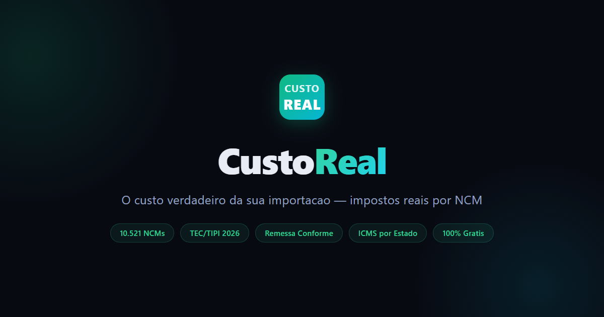

# CustoReal - O Custo Verdadeiro da Sua Importacao

  

  
  
  
  

  <strong><a href="https://calculadora-importacao-delta.vercel.app">Acessar Calculadora</a></strong>

---

## Funcionalidades

- **10.521 NCMs** com aliquotas II e IPI da TEC/TIPI 2026
- **1.852 produtos** catalogados com busca por nome ou NCM
- **Remessa Conforme** — MP 1.357/2026 (II 0% ate US$50, 60% acima)
- **Importacao Formal** (DI/Duimp) com todos os impostos: II, IPI, PIS, COFINS, ICMS
- **ICMS por estado** — aliquota interna de cada UF
- **Multiplos NCMs** — calcule varios produtos de uma vez com rateio por M3
- **Margem de lucro** — calcule preco de venda e markup
- **Dolar em tempo real** — cotacao automatica via API do BCB
- **PWA** — instale como app no celular

## Impostos Calculados

| Imposto | Base | Observacao |
|---------|------|-----------|
| II | TEC 2026 (Anexos I-IX) | DCC > LETEC > Applied > TEC base |
| IPI | TIPI 2026 | Por NCM (8 digitos) |
| PIS | 2,10% | Importacao formal |
| COFINS | 9,65% + 0,6% adic. | 2026 |
| ICMS | Por estado (por dentro) | 17-25,5% conforme UF |
| AFRMM | 8% do frete maritimo | Automatico por via de transporte |

## Remessa Conforme (MP 1.357/2026)

| Faixa | II | ICMS | PIS/COFINS/IPI |
|-------|-----|------|---------------|
| Ate US$50 | 0% (isento) | 17% ou 20% | 0% |
| Acima US$50 | 60% (desc. US$20) | 17% ou 20% | 0% |

## Stack

- HTML/CSS/JS vanilla (arquivo unico)
- Vercel (deploy)
- Zero dependencias de servidor

## Autor

**Caio Sales** — Salvador/BA
